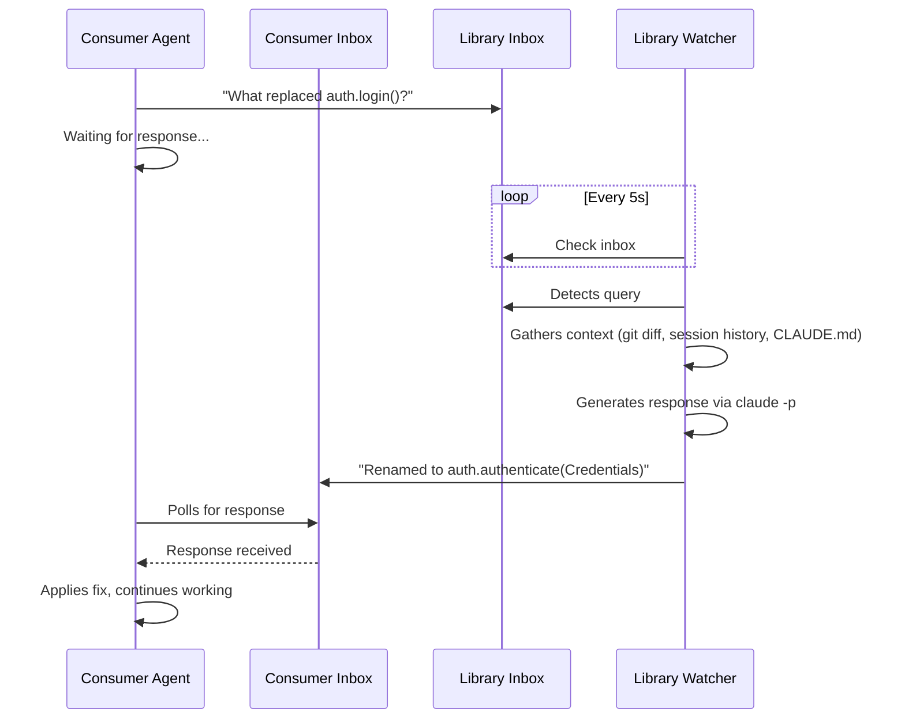
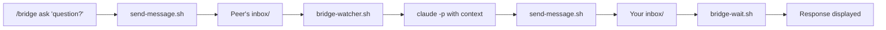

<p align="center">
  <h1 align="center">claude-bridge</h1>
  <p align="center">
    <strong>Peer-to-peer communication between Claude Code sessions</strong>
  </p>
  <p align="center">
    <a href="https://github.com/anthropics/claude-bridge/actions/workflows/test.yml"></a>
    <a href="LICENSE"></a>
  </p>
  <p align="center">
    <a href="#installation">Installation</a> &middot;
    <a href="#quick-start">Quick Start</a> &middot;
    <a href="#commands">Commands</a> &middot;
    <a href="#how-it-works">How It Works</a> &middot;
    <a href="#known-limitations">Limitations</a>
  </p>
</p>

---

When you're working across multiple repos — a shared library and its consumer app, a backend and frontend, microservices — each Claude Code session is isolated. **claude-bridge** lets them talk to each other.

The Library agent answers questions about breaking changes. The Consumer agent asks what API replaced `auth.login()`. Automatically. No copy-pasting between terminals.



## Prerequisites

- [Claude Code](https://claude.ai/claude-code) CLI installed and authenticated
- [`jq`](https://jqlang.github.io/jq/) for JSON processing

```bash
# macOS
brew install jq

# Linux
sudo apt install jq
```

## Installation

### Via marketplace (recommended)

```bash
claude plugin marketplace add owner/claude-bridge
claude plugin install claude-bridge
```

### Via clone

```bash
git clone https://github.com/owner/claude-bridge.git ~/claude-bridge
claude --plugin-dir ~/claude-bridge/plugins/claude-bridge
```

<details>
<summary>Persistent loading (no --plugin-dir needed)</summary>

Clone the repo, then add to `~/.claude/settings.json`:

```json
{
  "plugins": [
    "~/claude-bridge/plugins/claude-bridge"
  ]
}
```

</details>

## Quick Start

> Two terminals, two projects, one bridge.

**Terminal 1 — Library project:**
```bash
cd ~/projects/my-library
claude --plugin-dir ~/claude-bridge/plugins/claude-bridge
```
```
> /bridge start

Bridge active! Session ID: a1b2c3
Background watcher running — peer queries will be auto-answered.
```

**Terminal 2 — Consumer app:**
```bash
cd ~/projects/my-app
claude --plugin-dir ~/claude-bridge/plugins/claude-bridge
```
```
> /bridge start
> /bridge connect a1b2c3

Connected to 'my-library' (a1b2c3)

> /bridge ask "What replaced auth.login()?"

Asking my-library... waiting for response.

Response from my-library:
  auth.login() was renamed to auth.authenticate().
  It now takes a Credentials object instead of separate
  username/password params.
```

That's it. The Consumer agent can now also query the Library automatically when it encounters dependency errors.

## Commands

| Command | Description |
|---------|-------------|
| `/bridge start` | Register this session and start the background watcher |
| `/bridge connect <id>` | Connect to a peer session (auto-starts if needed) |
| `/bridge peers` | List all active sessions on this machine |
| `/bridge ask <question>` | Send a question and wait for the response |
| `/bridge status` | Show session ID, connected peers, pending messages |
| `/bridge watch` | Manually start the background watcher |
| `/bridge unwatch` | Stop the background watcher |
| `/bridge stop` | Disconnect, notify peers, clean up |

## How It Works

### The watcher

When you run `/bridge start`, a background watcher process starts automatically. It:

1. **Polls** the inbox every 5 seconds for new messages
2. **Gathers context** for incoming queries — git diff, recent commits, active session conversation history, CLAUDE.md
3. **Generates a response** via `claude -p` with that full context
4. **Sends the response** back to the sender's inbox

The watcher reads the active Claude Code session's conversation from `~/.claude/projects/` — so it knows what the agent has been working on, not just the code.

### Message flow



### Architecture

```
~/.claude/bridge/
└── sessions/
    ├── <session-id>/
    │   ├── manifest.json     # Identity and heartbeat
    │   ├── inbox/            # Messages TO this session
    │   ├── outbox/           # Messages FROM this session (audit)
    │   ├── watcher.pid       # Watcher process ID
    │   └── watcher.log       # Watcher activity log
    └── ...
```

**Design principles:**
- No shared mutable state — each session owns its manifest
- Atomic file writes — temp file + `mv` prevents partial reads
- UUID message IDs — no collision risk
- Connection via ping handshake — peers never mutate each other's manifests

## Known Limitations

### API Cost

> **Important:** The watcher calls `claude -p` for every incoming query, consuming API credits.

There is no rate limiting. Each peer query triggers a separate API call with project context. Monitor your usage if cost is a concern.

### Privacy

The watcher reads local Claude Code session data to build context:

| Data source | What it reads | Why |
|-------------|--------------|-----|
| `~/.claude/history.jsonl` | Active session ID per project | To find the right conversation |
| `~/.claude/projects/<path>/<id>.jsonl` | Recent user/assistant messages | Context for the auto-responder |
| Git diff, commits | Code changes | What's being worked on |
| `CLAUDE.md` | Project conventions | Project-specific context |

Your conversation history is fed into `claude -p` prompts locally — **it's never sent to peers**. Only the generated response is shared.

### Relies on Claude Code internals

The plugin reads `~/.claude/projects/` and `~/.claude/history.jsonl` which are undocumented internal formats. If Anthropic changes these, the session context feature may break. Core messaging (inbox/outbox) would continue working — only auto-response quality would degrade.

### Platform support

| Platform | Status |
|----------|--------|
| macOS | Tested |
| Linux | Should work (GNU `date` fallback) |
| Windows | Not supported yet |

### Other considerations

- **Polling latency** — ~10-20s round-trip (5s poll interval + `claude -p` generation time). Fine for cross-project coordination, not for real-time chat.
- **No encryption** — Messages are plain JSON, protected by Unix file permissions. Don't put secrets in bridge messages.
- **No message size limits** — Large messages = expensive `claude -p` calls.
- **Session accumulation** — Crashed sessions may persist. Use `/bridge peers` to check, `/bridge stop` to clean up.

## Plugin Structure

<details>
<summary>Click to expand</summary>

```
plugins/claude-bridge/
├── .claude-plugin/
│   └── plugin.json
├── commands/
│   └── bridge.md                # /bridge command (all subcommands)
├── hooks/
│   └── hooks.json               # SessionEnd cleanup, PreCompact preservation
├── skills/
│   └── bridge-awareness/
│       └── SKILL.md             # Teaches agent the bridge protocol
├── scripts/
│   ├── register.sh              # Create session directory and manifest
│   ├── send-message.sh          # Send message to peer's inbox
│   ├── check-inbox.sh           # Scan inboxes for pending messages
│   ├── list-peers.sh            # List active sessions
│   ├── connect-peer.sh          # Ping to establish connection
│   ├── heartbeat.sh             # Update session heartbeat
│   ├── cleanup.sh               # Remove session, notify peers
│   ├── bridge-watcher.sh        # Background auto-responder
│   └── bridge-wait.sh           # Block until response arrives
└── tests/
    ├── test-helpers.sh           # Shared assertions
    ├── test-register.sh
    ├── test-send-message.sh
    ├── test-check-inbox.sh
    ├── test-list-peers.sh
    ├── test-connect-peer.sh
    ├── test-cleanup.sh
    ├── test-heartbeat.sh
    └── test-integration.sh       # End-to-end two-session test
```

</details>

## Running Tests

```bash
cd plugins/claude-bridge
for t in tests/test-*.sh; do
  echo "=== $(basename $t) ==="
  bash "$t"
  echo
done
```

## Contributing

Contributions are welcome! Please open an issue or PR.

## License

[MIT](LICENSE)
